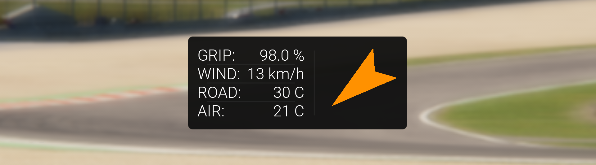

# Track Conditions
This is an app for Assetto Corsa, a racing simulator built by Kunos Simulazioni. It provides the user with a live wind indicator, as well as information on the wind speed, ambient temperature, track temperature and track grip state.

## Installation guide
Install the app by pasting the contents of the .zip file in the main root folder of the Assetto Corsa installation. After this, the app must be activated in the main menu within Assetto Corsa.

## Configuration
The app is user configurable and is integrated with Content Manager. After first launch, options like app size can be tweaked using the config.ini file in the app folder or through Content Manager.

## Wind Indicator
The arrow acts as an indicator for the true wind: It points in the direction the wind is going, relative to the direction the car is facing. For example, if the arrow is pointing upwards, the car experiences a tailwind. 

The wind indicator is color-coded. It shows green for a headwind, yellow for a crosswind and red for a tailwind. A headwind associated with green because the car has increased downforce.

## Notes
In replay mode, there is no accurate data available from the simulator. To avoid displaying wrong information, the wind indicator gets greyed out and other data fields are presented empty.