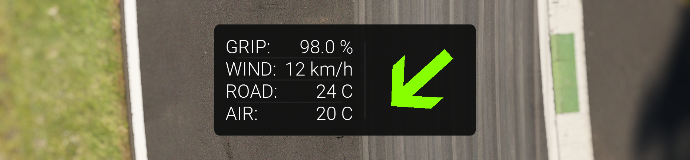

# Track Conditions

This is an app for Assetto Corsa, a racing simulator built by Kunos Simulazioni. It provides the user with a live wind direction indicator, as well as the wind speed, ambient temperature, track temperature and track grip state. 

## Installation and setup

The app can be installed by pasting the content of the .zip file in the main root folder of Assetto Corsa, and must be enabled in the Assetto Corsa main menu. The size of the app can be tweaked in the config file.

## Wind Indicator
By default, the indicator acts as a wind vane for the true wind: It points into the wind, relative to the direction the car is facing. For example, if the vane is pointing downwards, that means the true wind is coming from behind: the car experiences a tailwind. The true wind is the wind that is experienced when stationary; the headwind that results from moving is excluded.

The wind indicator is color-coded. It shows green for a headwind, yellow for a crosswind and red for a tailwind. A headwind associated with green because the car has increased downforce.

The wind indicator functionality is user configurable. If you wish that the wind indicator acts as an arrow that points where the wind is going, rather than toward the source, you can set this in the config.